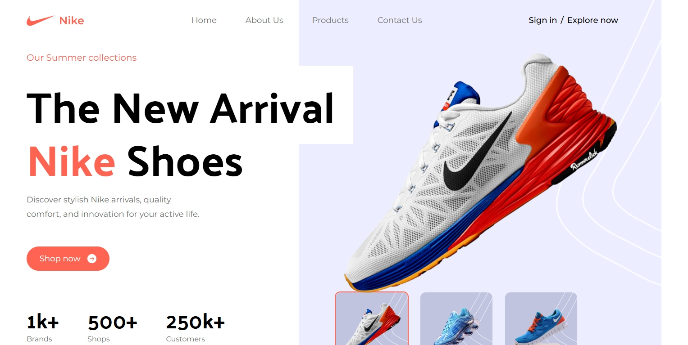
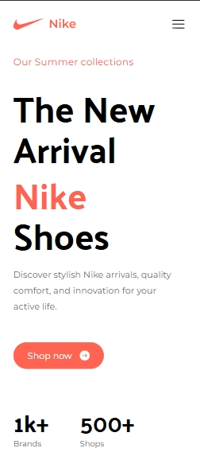

# 👟 Nike UI/UX Design Project

A modern, sleek and responsive UI/UX design concept for Nike, created to showcase front-end design skills and creativity in building brand-centric user interfaces.

## 🚀 Project Overview

This project is a **UI/UX redesign** for Nike’s online presence, focusing on enhancing user experience, modern visual appeal, and responsive design across devices. It demonstrates key aspects of **web design, usability, and interactivity**.

### 🔥 Features

- 🖼️ Eye-catching landing page
- ⚡ Smooth transitions and animations
- 📱 Mobile responsive layout
- 🎨 Brand-themed color palette and typography
- 🧭 Intuitive navigation
- 🛒 Interactive product cards (hover effects, CTA)
- 🌙 Optional dark mode toggle (if applicable)

## 🛠️ Tech Stack

-**React.js** – Core frontend library.
-**JavaScript** – Scripting language.
-**HTML5** – Markup structure (via JSX).
-**Tailwind CSS** – Styling.
-**React Router** – For page navigation.
-**Vite / Create React App** – Project bundler.

## 📸 Screenshots

| Landing Page | Mobile View |
|--------------|-------------|
|  |  |

## 🧠 Inspiration

Nike’s branding is bold and dynamic. This design captures that spirit while ensuring ease of use and fluidity in navigation. The goal was to create a design that **feels powerful yet minimal**.

## ✅ To-Do / Improvements

- [ ] Add more product categories  
- [ ] Integrate real product data (API)  
- [ ] Add cart functionality  
- [ ] Dark mode support

## 📬 Contact

Made ❤️ by **Rushikesh Godase**  
📧 [godaserushikesh07@gmail.com]  
🔗 [https://www.linkedin.com/in/rushikesh-vijay-godase07]

---

